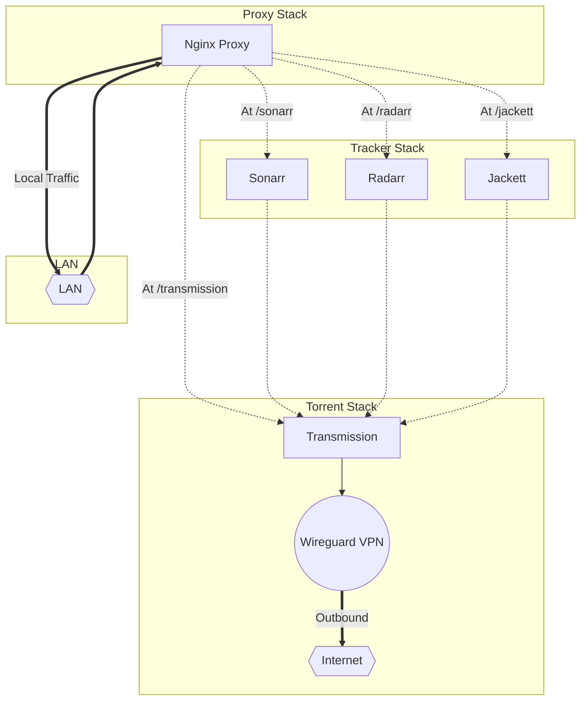
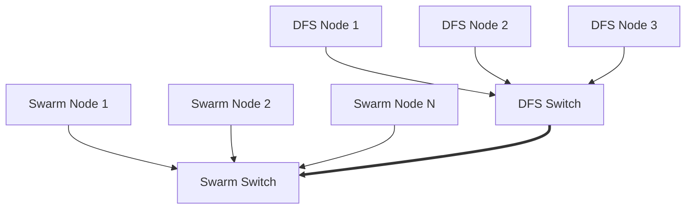

# Docker Download Box 

A stack of docker containers that integrate Sonarr & Radarr with a Wireguard based VPN and Transmission

## Description

As a project to get my head around Docekr swarm, I decided to set up a HTPC download box system.

The Docker Compose stacks here implement a completely self-contained download box. A wireguard based VPN is linked with a Transmission service for security. Sonarr, Radarr, and Jackett sit as a stack working with the Transmission client. Finally, all of the various endpoints are proxied through NGINX.

Included are sources from various other OSS projects, as I wanted this to be run on a heterogenious cluster - ARM v7, ARM 64, and x86-64.

Storage is currently expceted to be available as a mounted folder on each node. I'm using NFS for the time, but eventually plan to integrate Gluster or MooseFS into the system. 

### Shared Storage For HTPC

MooseFS or GlusterFS TBD. Currently using NFS

### Cluster:

Multiple heterogenious SBCs just becasue. However, this stack can run on a single node just fine.

### Layout

## Getting Started

### Dependencies

* Describe any prerequisites, libraries, OS version, etc., needed before installing program.
* ex. Windows 10

### Installing

* How/where to download your program
* Any modifications needed to be made to files/folders
## Board Plan

##  *Reliable NAS?*
https://www.universalmediaserver.com/comparison/

https://hub.docker.com/r/universalmediaserver/ums

